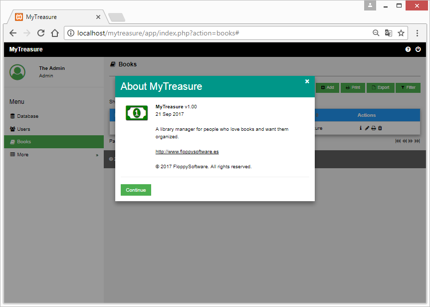
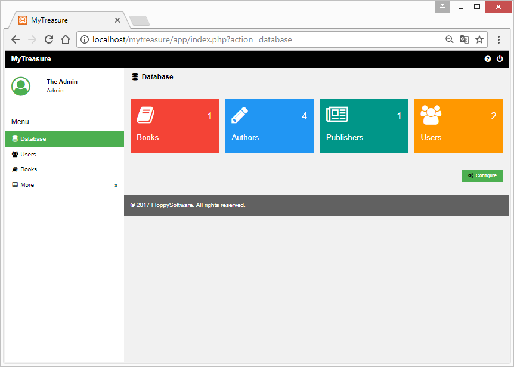
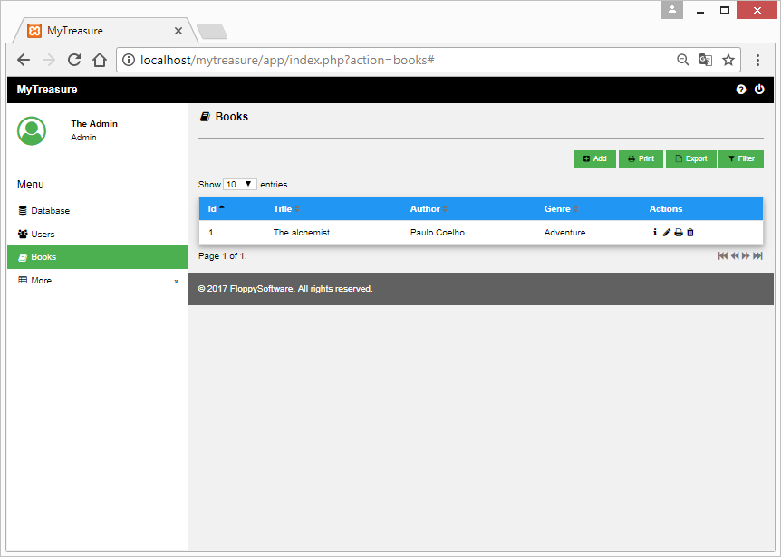
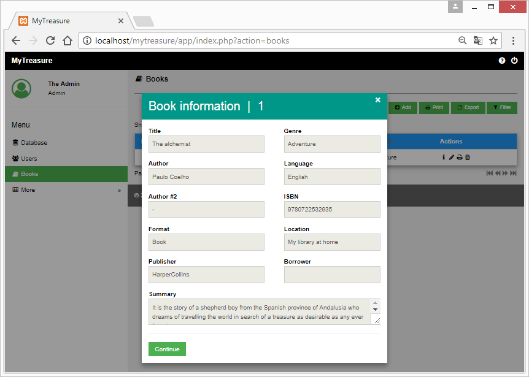
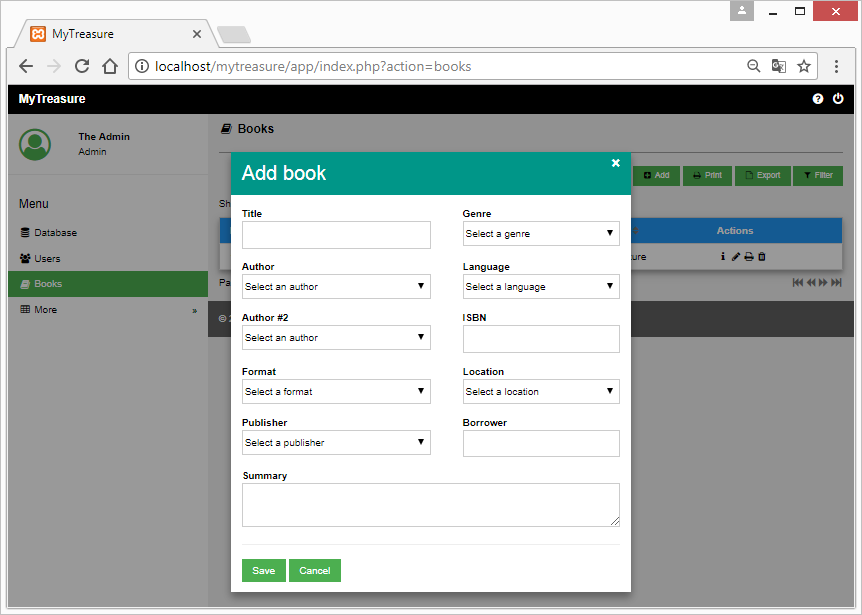

# MyTreasure

## What is MyTreasure?

**MyTreasure** is a library manager for people who love books and want them organized.



## Why another library manager?

Well, in short: **I** have a lot of books and **I** want them organized.

I *love* computer programming and this application is good for me (it just does the job as I want).

And if it's good for you... well, it's free, you can use it too!

You will find the license details at the end of this file.

## What technology does MyTreasure use?

MyTreasure was written with the following computer languages:

- **PHP** as primary language.
- **HTML** and **CSS** for the web views.
- **MySQL** to store the data of the books.
- and a bit of **JavaScript** to glue some things.

It uses the [W3.CSS framework](https://www.w3schools.com/w3css/) and [Font Awesome](http://fontawesome.io/) for the icons.

The background image comes from [Awswallpapershd.com](http://awswallpapershd.com/books-free-wallpaper-background/books-free-wallpaper-background/) by paulina, November 9, 2016.

## What I need to run MyTreasure in my computer?

As MyTreasure is an application which uses web technologies to do its job and MySQL to store data, you will need the following to run it in your personal computer:

- A web server with support of the PHP language (version 5.x or higher). The Apache web server, for example.
- A MySQL or compatible database server. Your choice could be MySQL or MariaDB.
- A web browser with the JavaScript language enabled.

To develop (and run) MyTreasure in my personal computer I use [XAMPP](https://www.apachefriends.org/es/index.html), which includes the two first requirements (web server, PHP, MySQL).

## Can I install MyTreasure as a conventional web application?

Yes, of course. MyTreasure **is** a web application.

## What I need to do to install MyTreasure in my personal computer?

You must do the following:

- First of all: install a web server with PHP support and a MySQL or compatible database server on your computer if you need to do so.
- Create a database called `my_treasure` by running the script `my_treasure.sql` in your database server. For example:
```
mysql -u root -p < my_treasure.sql
```
- Download MyTreasure and place it in a directory inside the XAMPP htdocs directory (or equivalent for your web server). In my personal computer that directory is: `C:\xampp\htdocs\mytreasure\`.
- Configure the file `conf.php` located in `mytreasure\app\libs` to meet your language and database requirements. Leave the rest of the file as is.

  - Currently, you can set `es` for Español (Spanish) or `en` for English.
```php
$CF['app_language']  = 'es';
```
  - My database configuration looks like this:
```php
$CF['db_server']     = 'localhost';
$CF['db_name']       = 'my_treasure';
$CF['db_user']       = 'root';
$CF['db_password']   = '';
```

## Once installed, how can I run MyTreasure?

- Run the web and database servers.
- Open your web browser and type the following as the url: `http:\\localhost\mytreasure\`.
- Enter your username and password. By default, there are two users:
  - `admin`, with password: `admin`.
  - `reader`, with password: `reader`.
 
It is advisable to adjust the zoom of the web browser, for a better user experience.

## Who is the author?

It's **me**. ;)

My name is Miguel García, I'm a software developer from Spain.

Developing software it's not just my job. It's vocational, because I **love** computer programming since 1988 or so.

You can contact me at the following addresses:

[www.floppysoftware.es](http://www.floppysoftware.es)
floppysoftware@gmailcom

## Can I contribute to MyTreasure?

Yes, your feedback and suggestions are always welcomed.

And maybe a UI translation?

## License

MyTreasure is (c) 2017 Miguel García / FloppySoftware.

Released under the GNU General Public License v3.

See the file LICENSE.md for more details.

## More screenshots





